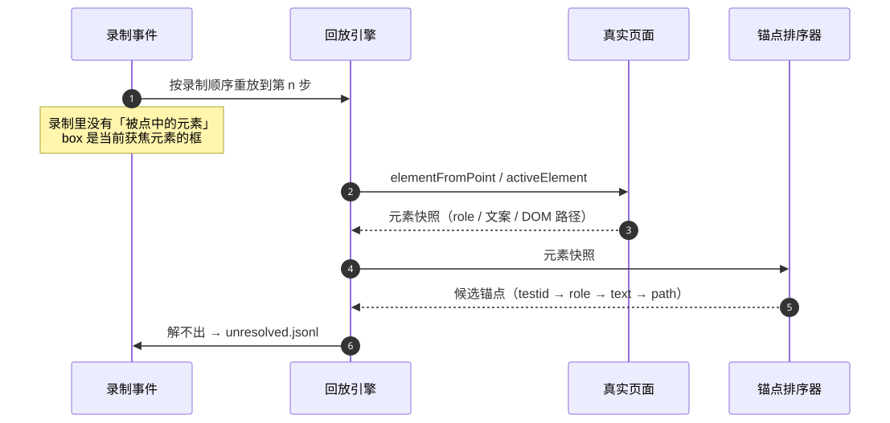

UI 回归测试一直有个尴尬的地方：**报告是红的，但它说明不了产品是坏的还是脚本是坏的**。人得先花时间确认这一点，才谈得上定位。

`trace-to-test` 是我最近写的一个框架，专门解决这件事。做法可以一句话说完：**把一次真实的浏览器操作录下来，编译成一条声明式回归，再以零 LLM 的方式确定性重放**——重放结束只给你一个结论，而那个结论会区分「产品漂移」和「测试写坏」。

- 仓库：<https://github.com/ABK3528/trace-to-test>
- 语言：Python ≥ 3.12，机制层零业务词，可跨项目复用
- 现状：v1 打通了一条 UI 竖切（录制 → 编译 → 回放），`make demo` 一条命令可自证

## 两条老路，各自的硬伤

| 做法 | 硬伤 |
| --- | --- |
| 手写脚本（Selenium / Playwright） | 锚点靠人挑。写的时候页面长什么样就照着写，页面一改整片红，而**红的是不是产品坏了**没人能一眼判断 |
| 让 LLM 每次现场驱动浏览器 | 不确定。同一个用例今天过明天不过，**不可 CI**，而且失败原因无法归因 |

这两种做法的共同问题不是「不好写」，而是**结论不可信**。第一条路把「产品改文案」和「元素被删掉」混成同一个红；第二条路连「这个红可不可重复」都保证不了。

还有一条常被忽略的路——**视觉回归（像素 diff）**。它同样解决不了归因：像素变了到底是布局重构还是缺陷？v1 明确不做这条，只做语义锚点 + 文本/状态断言。

## 核心主张：AI 只进两个阶段

框架的全部设计都指向一个取舍：**让 AI 在「探索」和「编译」两个阶段介入，把它的判断固化成一段不依赖模型的确定性代码。**



| 阶段 | 谁来做 | 产物 |
| --- | --- | --- |
| ① 录制 | 人（或 AI）手动走一遍真实流程 | `events.jsonl`：动作、坐标、URL、截图、获焦元素 |
| ② 编译 | 编译器 + 一次带探针的回放 | `workflow.json` / `checks.json` / `unresolved.jsonl` / `checks.todo.md` |
| ③ 回放 | 纯代码，**零 LLM** | 三态判定之一 + 失败点 |

回放路径上没有任何模型调用，也没有随机性来源。同一条 workflow 在 CI 上可以跑一万次，结果一致——这正是它能进 CI 的前提。

## 这条链上有两个语义鸿沟

「录制 → 回放」听起来像录像回放，实际不是。中间隔着两个语义鸿沟，这也是这个框架存在的全部理由。

### 鸿沟一：录制记的是「做了什么」，回归要的是「怎么找到它」

`events.jsonl` 里一条点击长这样：

```json
{"helper": "click_at_xy", "x": 412, "y": 306, "url": "http://127.0.0.1:8712/list", "box": {...}}
```

坐标直接写进回归，等于把分辨率、字号、布局全锁死。所以 `core/compile/` 的真身不是转录器，而是**「坐标 → 语义锚点」的反解器**。

麻烦在于：录制里**没有「被点中的那个元素」**。动作里带的 `box` 是**当前获焦元素**的框，不是点击目标。想知道「当时点的是谁」，只能拿着坐标回到实时页面上重新问一次浏览器。

因此编译是一次**带探针的回放**：按录制顺序重放，在每个需要锚点的动作执行之前，用 `document.elementFromPoint(x, y)`（点击类）或 `document.activeElement`（输入/按键类）取元素快照，再交给纯函数排序器产出候选锚点。**编译器复用回放引擎——两者是同一个引擎的两种模式**：回放模式断言结果，探针模式采集锚点。



这也带来两条硬约束：**编译期目标必须可达**，且**视口要与录制时一致**（探针按录制坐标去问元素，视口变了它问到的就是另一个元素，而一切看起来都正常）。

锚点的优先级是固定的：



`testid` 排第一而不是文本，理由很实在：**文案会随发布变化**，拿文案定位会把「按钮没了」和「按钮改叫别的了」混成一件事。所以 `role`/`text` 类锚点会被标上 `copy_sensitive: true`，交给三态判定去区分——见下文。

而 `xy` 只是最后兜底：用到会打 `WARN`，并且必须在报告里单列。

:::warning
**反解不出的事件不许默默降级成坐标。** 解不出的动作会写成 `unresolved.jsonl` 的一条，带上原始事件、候选锚点列表、以及**为什么解不出**（例如 `value_ref_required`、`ambiguous`）。人补齐后重新编译。这是「录的时候能跑、换个环境就死」的唯一闸门。
:::

### 鸿沟二：录到的观测值不能当期望值

把「探索时看到什么」直接写成断言，等于把当下的现状固化成基线——**如果那一刻已经有个 bug，这个 bug 就被写成期望值了**。

所以编译器**只产路径和观测快照，断言位留空**，标成 `TODO_ASSERT`，并产出一份待办：

```markdown
# 待补断言：wf-demo-smoke-…

编译器只给路径与观测点，**期望值必须来自外部**（需求文档 / 夹具 / 手写）。
- [ ] step 4 (click `登 录`): 断言语义 —— 期望值请从需求文档/夹具取
- [ ] step 7 (click `confirm-create`): 断言语义 —— 期望值请从需求文档/夹具取
```

`checks.json` 里每条断言**必须带 `source` 字段**声明期望值出处（`spec:` / `prd:` / `fixture:` / `handwritten:`）。`core/lint/checks_lint.py` 会拒收两类反模式并返回非零退出码：

1. **无断言**（只有一个能跑通的路径，等于没测）；
2. **`source` 缺失或形如 `observed:*`**（即抄了编译期观测值）。

## 怎么读结果：三态判定

回放只给一个结论，取三态之一：



| 结果 | 判据 | 含义 |
| --- | --- | --- |
| `PASS` | 步骤全部定位成功，且外部来源的断言全过 | 通过 |
| `FAIL_PRODUCT` | 锚点找得到，但断言值不对（`reason=assertion`） | **产品**漂移或缺陷 |
| `FAIL_PRODUCT` | 锚点失效，**但存在近似匹配**（`reason=anchor_drift`） | 元素还在，只是文案改了 → 产品改动 |
| `FAIL_ANCHOR` | 锚点找不到且无可近似匹配（`reason=missing`） | 元素没了 / 结构变了 → 脚本问题 |
| `FAIL_ANCHOR` | 锚点匹配到多个不同元素（`reason=ambiguous`） | 判据不唯一 → 脚本问题 |

其中 `anchor_drift` 这条值得单独说。`role`/`text` 锚点是对文案敏感的：文案一变它们就失效。如果直接判 `FAIL_ANCHOR`，**真实的文案改动会被误报成「测试写坏了」**；反过来拿坐标兜底，又退回了鸿沟一。所以这类锚点失效时会做一次归一化近似匹配（去空白、去标点、大小写折叠，相似度 ≥ 阈值即算命中）：

- 元素还在、只是标签变了 → 归 `FAIL_PRODUCT`，带 `reason=anchor_drift`；
- 连近似匹配都没有 → 才归 `FAIL_ANCHOR`。

`testid` 锚点**不做**近似匹配（它没有可比较的文本），锚点失效时直接 `FAIL_ANCHOR`。这正是「改文案」和「摘锚点」两种场景能分开的原因。

:::note
**一个容易踩的次序问题。** 回放在**第一个失败点即停**（后面的步骤结果不可信），所以断言挂在哪一步很重要。要证明「锚点缺失 → `FAIL_ANCHOR`」，断言必须挂在最后一个动作之后。否则摘掉 testid 时先撞上的会是断言自己的 testid，判定被归成 `FAIL_PRODUCT`，两种状态就分不开了。
:::

## 三态之外：两个「还没有结论」的标注

回放判 `FAIL_PRODUCT` 之前，会先跑三项业务无关的自查。它们**不构成第四态**，只决定「现在能不能下结论」：



| 自查 | 命中时 | 为什么不是第四态 |
| --- | --- | --- |
| 目标构建标识与本 workflow 记录的不一致 | `STALE_TARGET`，不下产品结论 | 环境没对齐，此时判产品坏或脚本坏都不成立 |
| 首轮失败、次轮通过 | `COLD_START_FLAKE`，重跑一次再判 | 重跑后的结果仍归入三态之一 |
| 依赖的探针端点未就绪 | `FAIL_ENV`，与产品问题分开计 | 只表示「这次没验成」，不表示产品有问题 |

一句话：`FAIL_ENV` / `STALE_TARGET` 是**「本次未得出结论」的标注**，不是结论。遇到它们先恢复可判定条件再重跑，**不要当产品或脚本的 bug 去改代码**。

## 架构：机制层和适配层的边界是硬的

框架分两层，边界不是「建议」，是 `scripts/portability_check.sh` 会扫的：



| 层 | 目录 | 规矩 |
| --- | --- | --- |
| **机制层** | `core/` `checks/` `skills/` | 零业务词、零 agent 专属依赖。**唯一需要保证可移植的部分** |
| **适配层** | `adapters/` | 业务只准活在这里：被测目标声明、凭据来源、期望值（oracle）来源、提示词骨架的项目实例片段 |

`make portability` 拿 `scripts/business_words.txt` 去 grep 机制层，**必须零命中**；白名单只放 `<target>` 这类占位符，且逐条带理由——新增一条白名单等于放宽约束，得在 PR 里说明。

落到你自己的项目，checklist 只有四条：

- [ ] 把项目专属词汇加进 `scripts/business_words.txt`，确认机制层仍通过 `make portability`
- [ ] 在 `adapters/` 实现本项目的 target 与 oracle 接口
- [ ] 把真实的探索流程放进 `adapters/instance/`
- [ ] **先跑通一条端到端竖切，再谈扩展**——不要先定接口

最后一条是我自己的教训：接口在只有一条竖切的时候定，几乎是必错。

## 上手：三条命令

需要 **Python ≥ 3.12**、[`uv`](https://docs.astral.sh/uv/)，以及本机装好的 **Chrome / Chromium**。

```bash
git clone https://github.com/ABK3528/trace-to-test.git
cd trace-to-test
uv sync --extra browser --extra dev   # browser: CDP 直控本机 Chrome；dev: pytest
```

仓库自带一个**零依赖的极简靶场**（`target_app/`：登录页、异步列表、弹窗、暗色模式、一个可控的偶发失败端点），用来自证整条链。跑它：

```bash
make demo
```

它会真录一遍、编译、补全，然后在四种情况下回放，最后打印判定表（下面是我本机的真实输出）：

```text
recording saved: …/recordings/demo-smoke-… (10 frames)
compiled → demo/build/compiled  (7 steps, 2 unresolved)
  unresolved: seq 3 fill_input — value_ref_required
  unresolved: seq 4 fill_input — value_ref_required
preflight: ok (-)
✅ baseline                     PASS           reason=-
✅ copy drifted                 FAIL_PRODUCT   reason=anchor_drift
✅ testids stripped             FAIL_ANCHOR    reason=missing
✅ artifact carries no coordinates 3 click step(s), xy=[None, None, None]
✅ recorded coords are stale now with='HTML|…' without='BUTTON|登 录'
✅ layout shifted (120px)       PASS           reason=-

🎉 三态可证：改文案 → FAIL_PRODUCT，摘锚点 → FAIL_ANCHOR，原样 → PASS
🎉 回放走锚点：产物不带坐标，且位移 120px 后仍 PASS（坐标已失效）
```

前两行证明**三态分得开**（改文案 → 产品问题；摘掉稳定钩子 → 测试问题）。后三行证明**回放走的是锚点而不是坐标**：把靶场布局整体下移 120px，录制时的坐标全部失效，回放仍然 PASS。

:::tip
**在容器/CI 里以 root 运行时**，Chrome 会拒绝启动（`Running as root without --no-sandbox is not supported`）。v0.1.0 尚未内置这个分支，在 `core/primitives/session.py` 的 `chrome_launch_args()` 里补一个 `os.geteuid() == 0` 时加 `--no-sandbox` 即可。指定浏览器用 `TTT_CHROME=<可执行文件路径>`。
:::

### 编译产物长什么样

`workflow.json` 是纯路径，**不含坐标**：

```json
{
  "id": "wf-demo-smoke-…",
  "title": "Login and open create dialog",
  "source": { "recording": "demo-smoke-…", "compiled_at": "2026-09-30T03:27:08+00:00",
              "viewport": [1440, 900], "build": "demo-build-1" },
  "steps": [
    { "n": 1, "action": "goto",  "path": "/login" },
    { "n": 2, "action": "fill",  "selector": "#username", "value_ref": "env:DEMO_USERNAME" },
    { "n": 4, "action": "click", "anchor": { "by": "role", "role": "button", "name": "登 录", "copy_sensitive": true } },
    { "n": 7, "action": "click", "anchor": { "by": "testid", "value": "confirm-create" } }
  ]
}
```

注意 `value_ref: env:DEMO_USERNAME`——`value_ref` 只允许指向环境变量或适配层声明的凭据名，**密码/令牌不进 workflow**。

`checks.json` 是断言的 sidecar，每条都带 `source`：

```json
{ "checks": [
  { "id": "c1", "after_step": 7, "kind": "count",
    "anchor": { "by": "testid", "value": "item-row" },
    "expect": "3", "source": "spec:demo/spec.md#2-列表页",
    "observed_at_compile": "" }
] }
```

`observed_at_compile` 只供人工比对，**永不参与回放判定**。

### 测试策略：`make test` 不覆盖什么

```bash
make test          # 195 passed, 5 skipped in 4.75s
make portability   # ✅ portability check passed (core checks)
```

那 **5 个 `skipped` 正是「本框架的差异化没有被执行」的证据**——端到端用例需要真实浏览器，默认跳过，只有 `TTT_E2E=1` 才跑。要证明框架端到端能跑通，**跑 `make demo`，不是 `make test`**。

## 已知边界（v1 的诚实清单）

这些是设计上就知道、且写在 README 里的：

- **`type_text` 暂不编译**，探索流程请优先用 `fill_input`；
- **`scroll` 事件按设计丢弃**：既不产生步骤，也不记 `Unresolved`。所以「滚动之后才点到的元素」可能编译出一个视口外的目标——要稳定就在探索脚本里先把元素滚进视口；
- **`xy` 只是兜底锚点**，用到会打 `WARN`；
- **v1 只覆盖 UI 轨**：接口生成 / 流程编排 / 契约三轨只留了骨架；
- **一个进程同一时刻只开一个 `Session`**（daemon 名进程内稳定），要并发请用不同进程；
- **密码是已知边界**：录制器把密码框内容遮蔽成 `•`，所以编译期探针会键入一串圆点、登录过不去，之后的锚点会**诚实地**落进 `Unresolved`——这是正确行为，不是缺陷。要编译的流程应当**从已登录会话开始录**，或在补全阶段用 `value_ref`（`env:<VAR>`）把凭证接回；
- **录制期点击竞态**：无头 Chrome 下合成点击偶尔不触发 `dialog.showModal()`。实测在一次 14 连跑的背靠背序列里连续失败 10 次（无头、本机带载），随后又连续成功——**失败率没有被良好刻画，别拿它当稳定概率**。它只发生在探索/录制阶段，回放路径不受影响。

把这些写进 README 而不是藏起来，是因为**测试工具的边界本身就是它的一部分可信度**：知道它在哪会假红，才知道什么时候该信它。

## 后面

三条轨（接口生成 / 流程编排 / 契约）的骨架已经留位，每条轨开工时遵循同一原则：**先有一条竖切跑通，再定该轨的接口**。

如果你也在被「红了但不知道是谁的错」折磨，可以先把靶场跑一遍（`make demo`，两分钟），再看 `demo/build/final/` 下的产物。仓库是公开的：<https://github.com/ABK3528/trace-to-test>。设计文档在 `docs/trace-to-test-design.md`，机制的实施计划在 `docs/trace-to-test-mechanism-plan.md`。
